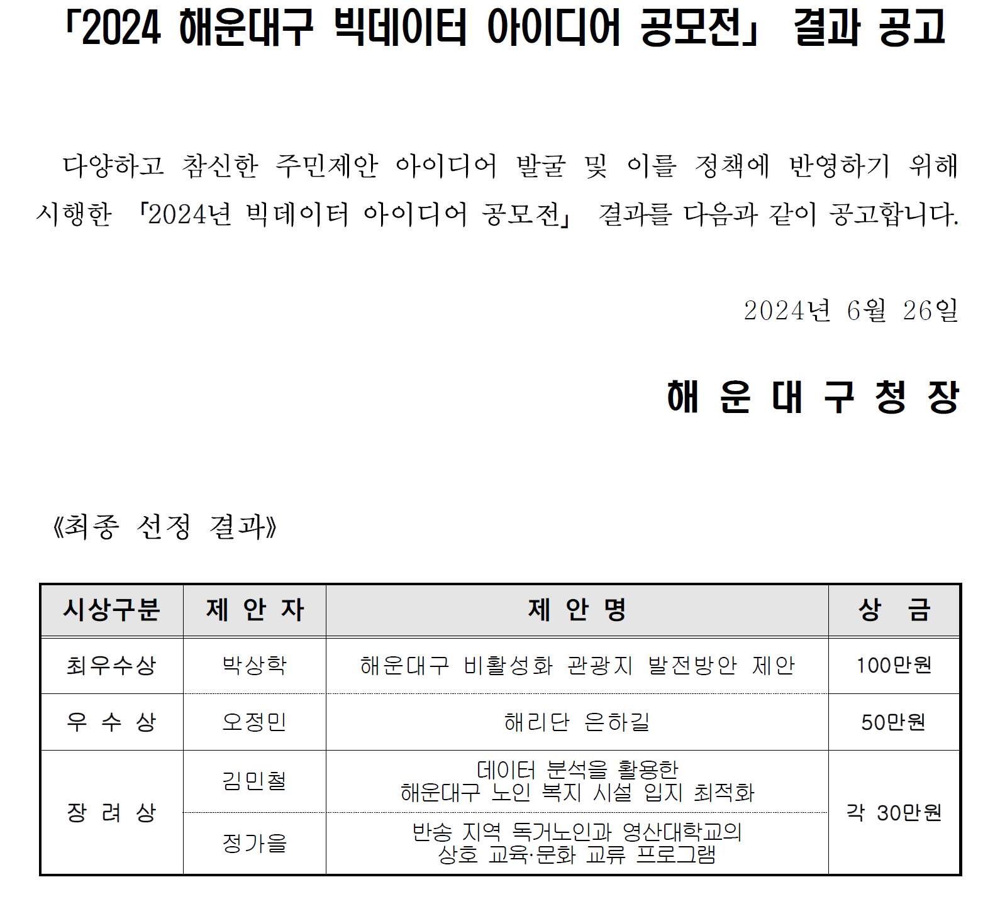

# Haeundae
## 공공 데이터 활용 전처리, 시각화 프로젝트
해운대구 빅데이터 공모전 [데이터 분석을 활용한 노인 복지 시설 입지 최적화]
- 18, 20, 23년 해운대구 인구 현황 데이터 활용 -> 고령 인구 높은 지역 탐색 , 고령화 증감율
- 사회 복지 시설 위치 데이터 시각화 -> 과밀, 과소 현황 파악
- 독거 노인 현황 조사

## Abstract

고령화 시대에 대응하여, 노인 복지 시설의 수요가 증대하고 그
수가 늘어나야 할 것이다. 하지만 해운대구 내에서 지역 별로,
노령 인구의 비율, 고령화 속도, 독거 노인의 비중이 전부
상이함으로 이를 고려하여 복지 시설 입지에 관한 의사 결정을
내려야 한다. 파이썬(Python), 태블로(Tableau)를 활용하여 관련
데이터를 전처리 및 시각화하였고 이에 따라 해운대구의 노인
복지 시설 추가 건립 시 행정 단위별 우선 순위를 제안한다.
1순위는 반여2, 3동이다. 높은 고령화 지표에 비해 복지 기관의
수가 턱없이 부족하기 때문이다. 2순위는 반여4동, 3순위 송정동,
4순위는 반송 1, 2동이다. 그리고 후순위는 중동, 재송동이다.
데이터 분석을 근거로 명시적인 우선 순위를 제시함으로써, 복지
기관의 입지를 고려할 때 지침을 제공한다.

## 첨부 자료
#자료1 
https://public.tableau.com/app/profile/.54043327/viz/1_17143946462570/2?publish=yes

#자료2
https://public.tableau.com/app/profile/.54043327/viz/1_17143946462570/1?publish=yes

#자료4
https://public.tableau.com/app/profile/.54043327/viz/4_17143947655110/1

## 

